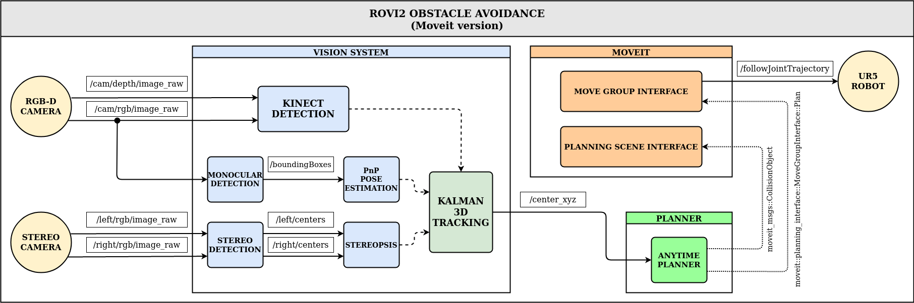

# ROVI2 PROJECT - OBSTACLE AVOIDANCE

This project was developed during the course of Robotics and Computer Vision 2 (spring 2018), at University of Southern Denmark, by Carlos, Richárd, Sergi and Mathesh. This simulation is an adaptation of the real setup, using an RGBD sensor, the _Moveit!_ framework for planning and a simulated red ball with random movement. The original development is [branch](https://github.com/CVH95/Salzburg/tree/rovi2-2018). Also, the [wiki](https://github.com/CVH95/Salzburg/wiki) belongs to the original development.


## Install instructions

Use python catkin tools to manage the workspace:

```sh
sudo apt install python-catkin-tools
```

Clone and install dependencies

```sh
cd ~
mkdir -p rovi2_ws/src && cd rovi2_ws/src
git clone https://github.com/CVEarp/ROVI2_Object_Avoidance.git

# Install dependencies via rosinstall and rosdeo
wstool update
cd ..
rosdep update
rosdep install -i --from-paths src/ -y -r

# Build
catkin init
catkin build
```

## Usage instructions

Use the package `rovi2_demo_manager` to run the demo, all the necessary `yaml` configuration and `launch` files are there. In separate terminals:

```sh
# Simulation environment and configurations
roslaunch rovi2_demo_manager scene_gazebo.launch

# 3D detection
roslaunch rovi2_demo_manager kinect_camera.launch

# Planner
roslaunch rovi2_demo_manager anytime_planner.launch
```

- - -

**NOTE:** There is a predefined _RVIZ_ configuration in `rovi2_demo_manager/config/workcell.rviz`, which has default windows to show detection and depth images, as well as relevant frame axes.

- - -

## System overview



## Packages and classes

- `anytime_planning` package.
  - Class list:
    - `AnytimePlanning`: Planning class interfacing _Moveit_ to create a pick & place-like loop.
  - Node list:
    - `anytime_planning_node`: Main node running `AnytimePlanning` class.
    - `random_ball_motion_node`: Node to move the red ball randomly around the workspace of the robot.
- `kalman_tracking_3d` library package.
  - Class list:
    - `KalmanTacking3d`: Class interfacing _OpenCV_ kalman class.
- `perception_avd` package.
  - Class list:
    - `common_perception`: Shared library with common utilities to the different detection methods.
    - `KinectDetection`: Class performing RGB-D detection and pose estimation of the red ball.
    - `RedBallDetection`: Class performing 2D image detection of the ball.
    - `Stereopsis`: Class for stereo triangulation and bounding box PnP pose estimation.
  - Node list:
    - `kinect_detection_node`: Publishes 3D position of the center of the ball using `KinectDetection` class.
    - `monocular_node`: Publishes 3D position of the center of the ball as a result of PnP 3D pose estimation.
    - `red_ball_detection_node`: Publishes ball center and bounding box in image coordinates.
    - `stereopsis_node`: Publishes 3D position of the center of the ball as a result of stereo triangulation.
- `rovi2_demo_manager` package. Main running interface of the application. Configuration files (in `YAML` format), as well as `launch` files for all the several nodes of the system are in this packages.
- `rovi2_msgs` package. Definition of ROS messages:
  - `boundingBox.msg` and `boundingBoxes.msg` to broadcast image coordinates and labels of bounding boxes detected for red ball(s).
  - `point2d` and `points2d` to broadcast image coordinates and labels of ball(s) center.
  -  `point3d` and `points3d` to broadcast 3D position and label of detected red ball(s).
- `workcell_scene_description` package: URDF files of the components and description of the workcell.


