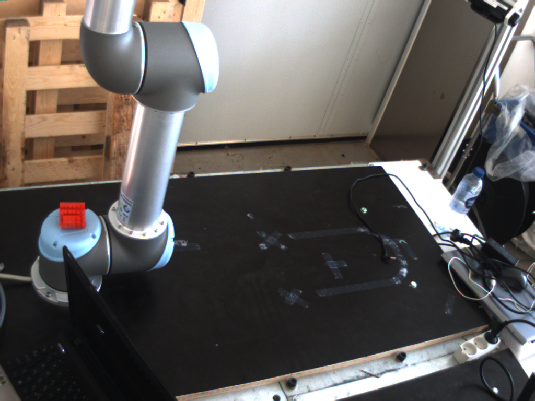
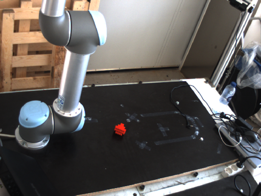

# Calibration test

Roughly the Triangulation works fine. Axes are well stablished, and linear movements along the X, Y or Z axis are well triangulated.

### Old calibration file

Centers:

```
Center (x, y) = (18.5, 412.5)
Center (x, y) = (18.5, 412.5)
Center (x, y) = (18.5, 412.5)
Center (x, y) = (18.5, 412.5)
Center (x, y) = (18.5, 412.5)
Center (x, y) = (18.5, 412.5)
Center (x, y) = (18.5, 412.5)
Center (x, y) = (18.5, 412.5)
Center (x, y) = (18.5, 412.5)
Center (x, y) = (18.5, 412.5)
Center (x, y) = (18.5, 412.5)
Center (x, y) = (18.5, 412.5)
Center (x, y) = (18.5, 412.5)
Center (x, y) = (18.5, 412.5)
Center (x, y) = (18.5, 412.5)
Center (x, y) = (18.5, 412.5)

```


```
Center (x, y) = (138, 412)
Center (x, y) = (138, 412)
Center (x, y) = (138, 412)
Center (x, y) = (138, 412)
Center (x, y) = (138, 412)
Center (x, y) = (138, 412)
Center (x, y) = (138, 412)
Center (x, y) = (138, 412)
Center (x, y) = (138, 412)
Center (x, y) = (138, 412)
Center (x, y) = (138, 412)
Center (x, y) = (138, 412)
Center (x, y) = (138, 412)
Center (x, y) = (138, 412)
Center (x, y) = (138, 412)
^CCenter (x, y) = (138, 412)
```

Triangulated points:

```
x = -781.519,  y = 200.944,  z = 943.282
x = -781.519,  y = 200.944,  z = 943.282
x = -781.519,  y = 200.944,  z = 943.282
x = -781.519,  y = 200.944,  z = 943.282
x = -781.519,  y = 200.944,  z = 943.282
x = -781.519,  y = 200.944,  z = 943.282
x = -781.519,  y = 200.944,  z = 943.282
x = -781.519,  y = 200.944,  z = 943.282
x = -781.519,  y = 200.944,  z = 943.282
x = -781.519,  y = 200.944,  z = 943.282
x = -781.519,  y = 200.944,  z = 943.282
x = -781.519,  y = 200.944,  z = 943.282
```


### New file

#### First Position

Centers:

```
Center (x, y) = (18.5, 412.5)
Center (x, y) = (18.5, 412.5)
Center (x, y) = (18.5, 412.5)
Center (x, y) = (18.5, 412.5)
Center (x, y) = (18.5, 412.5)
Center (x, y) = (18.5, 412.5)
Center (x, y) = (18.5, 412.5)
Center (x, y) = (18.5, 412.5)
Center (x, y) = (18.5, 412.5)
Center (x, y) = (18.5, 412.5)
Center (x, y) = (18.5, 412.5)
Center (x, y) = (18.5, 412.5)
Center (x, y) = (18.5, 412.5)

```


```
Center (x, y) = (138, 412)
Center (x, y) = (138, 412)
Center (x, y) = (138, 412)
Center (x, y) = (138, 412)
Center (x, y) = (138, 412)
Center (x, y) = (138, 412)
Center (x, y) = (138, 412)
Center (x, y) = (138, 412)
Center (x, y) = (138, 412)
Center (x, y) = (138, 412)
Center (x, y) = (138, 412)

```

Triangulated points:

```
x = -55.4727,  y = -169.152,  z = 89.5283
x = -55.4727,  y = -169.152,  z = 89.5283
x = -55.4727,  y = -169.152,  z = 89.5283
x = -55.4727,  y = -169.152,  z = 89.5283
x = -55.4727,  y = -169.152,  z = 89.5283
x = -55.4727,  y = -169.152,  z = 89.5283
x = -55.4727,  y = -169.152,  z = 89.5283
x = -55.4727,  y = -169.152,  z = 89.5283
x = -55.4727,  y = -169.152,  z = 89.5283
x = -55.4727,  y = -169.152,  z = 89.5283
x = -55.4727,  y = -169.152,  z = 89.5283
x = -55.4727,  y = -169.152,  z = 89.5283
x = -55.4727,  y = -169.152,  z = 89.5283
x = -55.4727,  y = -169.152,  z = 89.5283
x = -55.4727,  y = -169.152,  z = 89.5283
x = -55.4727,  y = -169.152,  z = 89.5283
x = -55.4727,  y = -169.152,  z = 89.5283

```


### New file

#### Second Position Position

Centers:

```
Center (x, y) = (357.775, 506.225)
Center (x, y) = (357.775, 506.225)
Center (x, y) = (357.775, 506.225)
Center (x, y) = (357.775, 506.225)
Center (x, y) = (357.775, 506.225)
Center (x, y) = (357.775, 506.225)
Center (x, y) = (357.775, 506.225)
Center (x, y) = (357.775, 506.225)
Center (x, y) = (357.775, 506.225)
Center (x, y) = (357.775, 506.225)
Center (x, y) = (357.775, 506.225)
Center (x, y) = (357.775, 506.225)
Center (x, y) = (357.775, 506.225)

```


```
Center (x, y) = (472.24, 504.76)
Center (x, y) = (472.24, 504.76)
Center (x, y) = (472.24, 504.76)
Center (x, y) = (472.24, 504.76)
Center (x, y) = (472.24, 504.76)
Center (x, y) = (472.24, 504.76)
Center (x, y) = (472.24, 504.76)
Center (x, y) = (472.24, 504.76)
Center (x, y) = (472.24, 504.76)

```

Triangulated points:

```
x = -253.961,  y = -462.411,  z = 126
x = -253.961,  y = -462.411,  z = 126
x = -253.961,  y = -462.411,  z = 126
x = -253.961,  y = -462.411,  z = 126
x = -253.961,  y = -462.411,  z = 126
x = -256.319,  y = -460.156,  z = 129.019
x = -253.961,  y = -462.411,  z = 126
x = -253.961,  y = -462.411,  z = 126
x = -253.961,  y = -462.411,  z = 126
x = -253.961,  y = -462.411,  z = 126
x = -253.961,  y = -462.411,  z = 126

```

### Positions:

##### Initial position of the object:




##### Final position of the object:


