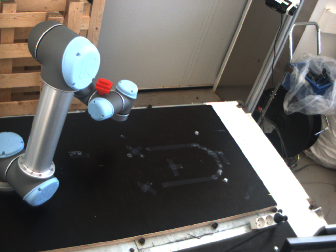

# Testing Collision detector

Seems to detect collisions now. Tested with the following setups:


### Collision == TRUE




 - On `collision_detector` node:

```sh
charlie@Asgard:~/catkin_ws$ rosrun planner collision_detector 
	>> WorkCell: /home/charlie/catkin_ws/src/ROVI2_Object_Avoidance/WorkCell_scenes/WorkStation_2/WC2_Scene.wc.xml
	>> Found device: UR1
	>> Red Ball created and added succesfully to the WorkCell.
	>> Created in: Transform3D(Vector3D(0, 0, 0), Rotation3D(0, 0, 0, 0, 0, 0, 0, 0, 0))
Vector3D(-232.8, -391.867, 101.732)
	>> Transform3D of 0x1c8a2b0:
	>> Transform3D(Vector3D(-232.8, -391.867, 101.732), Rotation3D(1, 0, 0, 0, 1, 0, -0, 0, 1))

Vector3D(-88.1476, -412.237, 323.352)
	>> RedBall:   Transform3D(Vector3D(-88.1476, -412.237, 323.352), Rotation3D(1, 0, 0, 0, 1, 0, -0, 0, 1))
Configuration in collision: Q[6]{1.21745, -1.76393, -1.87246, -1.55601, 3.5312, 0.122671}
Colliding frames: 
UR1.Joint3 UR1.Joint6
UR1.Joint4 UR1.Joint6
Collision detected in Q = Q[6]{1.21745, -1.76393, -1.87246, -1.55601, 3.5312, 0.122671}
	>> Path checked in 0.214 seconds.

Vector3D(-88.6684, -411.523, 324.278)
	>> RedBall:   Transform3D(Vector3D(-88.6684, -411.523, 324.278), Rotation3D(1, 0, 0, 0, 1, 0, -0, 0, 1))
Configuration in collision: Q[6]{1.21745, -1.76393, -1.87246, -1.55601, 3.5312, 0.122671}
Colliding frames: 
UR1.Joint3 UR1.Joint6
UR1.Joint4 UR1.Joint6
Collision detected in Q = Q[6]{1.21745, -1.76393, -1.87246, -1.55601, 3.5312, 0.122671}
	>> Path checked in 0.139 seconds.

Vector3D(-88.1476, -412.237, 323.352)
	>> RedBall:   Transform3D(Vector3D(-88.1476, -412.237, 323.352), Rotation3D(1, 0, 0, 0, 1, 0, -0, 0, 1))
Configuration in collision: Q[6]{1.21745, -1.76393, -1.87246, -1.55601, 3.5312, 0.122671}
Colliding frames: 
UR1.Joint3 UR1.Joint6
UR1.Joint4 UR1.Joint6
Collision detected in Q = Q[6]{1.21745, -1.76393, -1.87246, -1.55601, 3.5312, 0.122671}
	>> Path checked in 0.137 seconds.

Vector3D(-88.6684, -411.523, 324.278)
	>> RedBall:   Transform3D(Vector3D(-88.6684, -411.523, 324.278), Rotation3D(1, 0, 0, 0, 1, 0, -0, 0, 1))
Configuration in collision: Q[6]{1.21745, -1.76393, -1.87246, -1.55601, 3.5312, 0.122671}
Colliding frames: 
UR1.Joint3 UR1.Joint6
UR1.Joint4 UR1.Joint6
Collision detected in Q = Q[6]{1.21745, -1.76393, -1.87246, -1.55601, 3.5312, 0.122671}
	>> Path checked in 0.138 seconds.
```

 - On `collision_listener` node:

```sh
charlie@Asgard:~/catkin_ws$ rosrun planner collion_listener 
Found Collisions?   
YES
Found Collisions?   
YES
Found Collisions?   
YES
Found Collisions?   
YES
Found Collisions?   
YES
Found Collisions?   
YES
Found Collisions?   
YES
Found Collisions?   
YES
Found Collisions?   
YES
Found Collisions?   
YES
Found Collisions?   
YES
Found Collisions?   
YES
Found Collisions?   
YES
Found Collisions?   
YES
Found Collisions?   
YES
Found Collisions?   
YES
```

### Collision == FALSE


