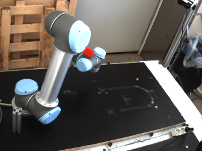

# Testing the function to move the ball in the WorkCell:


```sh
charlie@Asgard:~/catkin_ws$ rosrun planner collision_detector 

	>> WorkCell: /home/charlie/catkin_ws/src/ROVI2_Object_Avoidance/WorkCell_scenes/WorkStation_2/WC2_Scene.wc.xml
	>> Found device: UR1
	>> Red Ball created and added succesfully to the WorkCell.

Transform3D of the ball relative to device->getBase():   Transform3D(Vector3D(650, 650, 650), Rotation3D(1, 0, 0, 0, 1, 0, -0, 0, 1))

Transform3D of the ball relative to device->getBase():   Transform3D(Vector3D(-232.8, -391.867, 101.732), Rotation3D(1, 0, 0, 0, 1, 0, -0, 0, 1))

Ball in WORLD coordinates:  Vector3D(0, 0, 0)
Ball in UR5's Base coordinates:   Vector3D(0, 0, 0)

Path checked in 0.211 seconds.

Transform3D of the ball relative to device->getBase():   Transform3D(Vector3D(-232.8, -391.867, 101.732), Rotation3D(1, 0, 0, 0, 1, 0, -0, 0, 1))

Ball in WORLD coordinates:  Vector3D(0, 0, 0)
Ball in UR5's Base coordinates:   Vector3D(0, 0, 0)

Path checked in 0.137 seconds.

Transform3D of the ball relative to device->getBase():   Transform3D(Vector3D(-232.8, -391.867, 101.732), Rotation3D(1, 0, 0, 0, 1, 0, -0, 0, 1))

Ball in WORLD coordinates:  Vector3D(0, 0, 0)
Ball in UR5's Base coordinates:   Vector3D(0, 0, 0)

Path checked in 0.141 seconds.
```

Receives the coordinates from the vision block, but does not move inside RobWork.

### Corrected.

Ball moving now:

```sh 
charlie@Asgard:~/catkin_ws$ rosrun planner collision_detector 
	
	>> WorkCell: /home/charlie/catkin_ws/src/ROVI2_Object_Avoidance/WorkCell_scenes/WorkStation_2/WC2_Scene.wc.xml
	>> Found device: UR1
	>> Red Ball created and added succesfully to the WorkCell.
	>> Created in: Transform3D(Vector3D(0, 0, 0), Rotation3D(0, 0, 0, 0, 0, 0, 0, 0, 0))
Vector3D(-232.8, -391.867, 101.732)
	>> Transform3D of 0x1b482b0:
	>> Transform3D(Vector3D(-232.8, -391.867, 101.732), Rotation3D(1, 0, 0, 0, 1, 0, -0, 0, 1))

Vector3D(-100.245, -420.907, 322.375)
	>> RedBall:   Transform3D(Vector3D(-100.245, -420.907, 322.375), Rotation3D(1, 0, 0, 0, 1, 0, -0, 0, 1))
	>> Path checked in 0.217 seconds.

Vector3D(-101.748, -419.753, 323.656)
	>> RedBall:   Transform3D(Vector3D(-101.748, -419.753, 323.656), Rotation3D(1, 0, 0, 0, 1, 0, -0, 0, 1))
	>> Path checked in 0.139 seconds.

Vector3D(-100.409, -420.751, 322.52)
	>> RedBall:   Transform3D(Vector3D(-100.409, -420.751, 322.52), Rotation3D(1, 0, 0, 0, 1, 0, -0, 0, 1))
	>> Path checked in 0.144 seconds.

Vector3D(-100.409, -420.751, 322.52)
	>> RedBall:   Transform3D(Vector3D(-100.409, -420.751, 322.52), Rotation3D(1, 0, 0, 0, 1, 0, -0, 0, 1))
	>> Path checked in 0.141 seconds.

Vector3D(-100.579, -420.658, 322.658)
	>> RedBall:   Transform3D(Vector3D(-100.579, -420.658, 322.658), Rotation3D(1, 0, 0, 0, 1, 0, -0, 0, 1))
	>> Path checked in 0.141 seconds.

Vector3D(-100.743, -420.502, 322.803)
	>> RedBall:   Transform3D(Vector3D(-100.743, -420.502, 322.803), Rotation3D(1, 0, 0, 0, 1, 0, -0, 0, 1))
	>> Path checked in 0.141 seconds.
```



